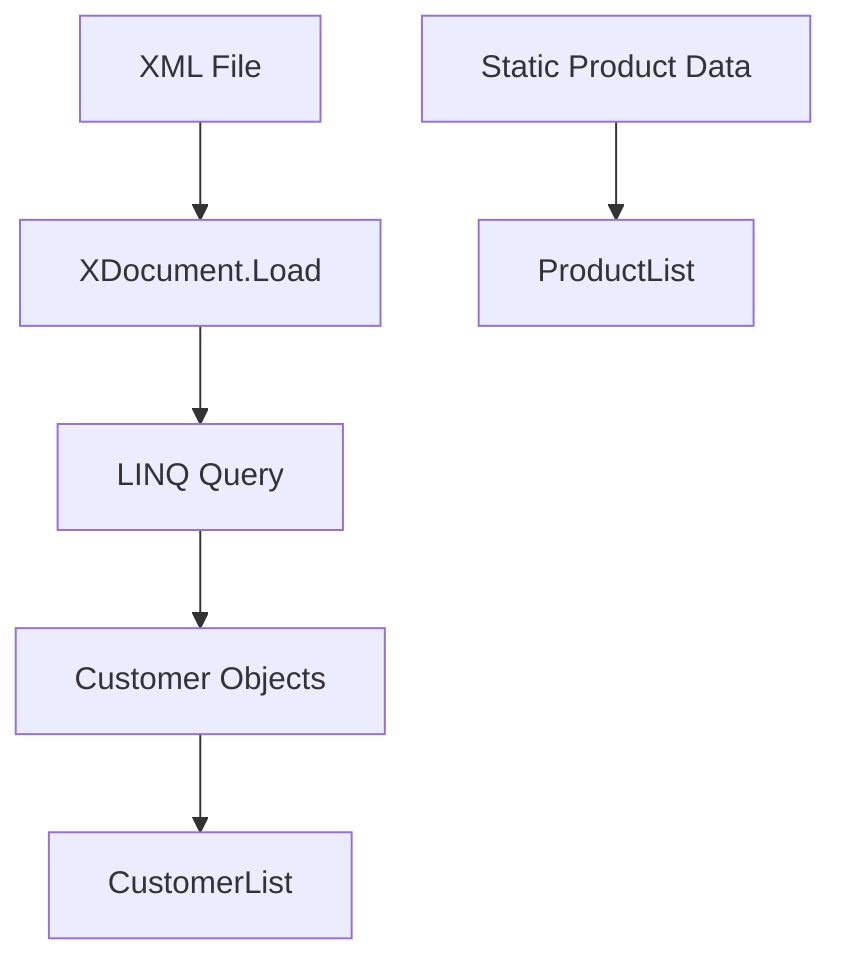

# LINQ Operators and Class Structures

## Introduction to LINQ Operators

LINQ (Language Integrated Query) operators can be used against sequences that implement the `IEnumerable` interface. These sequences can be of any data type, class, or collection. There are two main types of sequences:

1. Local Sequences
   - Static
   - XML
2. Remote Sequences

In this document, we'll focus on local sequences, both static and XML types.

## Project Structure

To organize our code, we'll create the following structure:

- Project Root
  - Data (Folder)
    - Product.cs
    - Order.cs
    - Customer.cs
  - ListGenerator.cs

## Class Definitions

### Product Class

```csharp
public class Product
{
    public long ProductID { get; set; }
    public string ProductName { get; set; }
    public string Category { get; set; }
    public decimal UnitPrice { get; set; }
    public int UnitsInStock { get; set; }

    public override string ToString()
        => $"ProductID: {ProductID}, ProductName: {ProductName}, Category: {Category}, UnitPrice: {UnitPrice}, UnitsInStock: {UnitsInStock}";
}
```

### Order Class

```csharp
class Order
    {

        public int OrderID { get; set; }
        public DateTime OrderDate { get; set; }
        public decimal Total { get; set; }

        public Order(int orderID, DateTime orderDate, decimal total)
        {
            OrderID = orderID;
            OrderDate = orderDate;
            Total = total;
        }
        public Order()
        {

        }

        public override string ToString()
            => $"Order Id: {OrderID}, Date: {OrderDate.ToShortDateString()}, Total: {Total}";
    }
```

### Customer Class

```csharp
  class Customer
    {
        public string CustomerID { get; set; }
        public string CustomerName { get; set; }
        public string Address { get; set; }
        public string City { get; set; }
        public string Region { get; set; }
        public string PostalCode { get; set; }
        public string Country { get; set; }
        public string Phone { get; set; }
        public string Fax { get; set; }
        public Order[] Orders { get; set; }
        public Customer(string customerID, string customerName)
        {
            CustomerID = customerID;
            CustomerName = customerName;
            Orders = new Order[10];
        }
        public Customer()
        {

        }
        public override string ToString()
            => $"{CustomerID}, {CustomerName}, {Address}, {City}, {Region}, {PostalCode}, {Country}, {Phone}, {Fax}";
    }
```

### ListGenerator Class

```csharp
internal class ListGenerator
{
    // This class will be used to generate lists of our data types
    // Implementation to be added later
}
```

## Notes

- The `Customer` class has an aggregate composition relationship with the `Order` class, represented by the `Orders` array property.
- The `ListGenerator` class is currently empty and will be implemented later to create lists of our data types for LINQ operations.
- All classes override the `ToString()` method to provide a string representation of their data.

In the next section, we'll implement the `ListGenerator` class and explore various LINQ operators using these data structures.


## ListGenerator Class

The `ListGenerator` class is designed to be a container for our data. It's implemented as a static class with static properties, which means:

- There can only be one instance of this class for the entire application.
- Its properties can be accessed without creating an instance of the class.
- It uses a static constructor to initialize its properties.

Here's the implementation of the `ListGenerator` class:

```csharp
public static class ListGenerator
{
    public static List<Customer> CustomersList { get; set; }
    public static List<Product> ProductList { get; set; }

    static ListGenerator()
    {
        ProductList = new List<Product>()
        {
            new Product() { ProductID = 1, ProductName = "Chai", Category = "Beverages", UnitPrice = 18.00M, UnitsInStock = 100 },
            new Product { ProductID = 2, ProductName = "Chang", Category = "Beverages", UnitPrice = 19.0000M, UnitsInStock = 17 },
            new Product { ProductID = 3, ProductName = "Aniseed Syrup", Category = "Condiments", UnitPrice = 10.0000M, UnitsInStock = 13 },
            // ... [The rest of the 77 products are listed here]
            new Product() { ProductID = 77, ProductName = "Original Frankfurter grüne Soße", Category = "Condiments", UnitPrice = 13.0000M, UnitsInStock = 32 }
        };

        // CustomersList initialization will be added here
    }
}
```

### Key Points about ListGenerator

1. **Static Class**: The `ListGenerator` class is declared as `static`, meaning it cannot be instantiated and all its members must also be static.

2. **Static Properties**: `CustomersList` and `ProductList` are static properties, allowing them to be accessed directly through the class name (e.g., `ListGenerator.ProductList`).

3. **Static Constructor**: The static constructor (which has no access modifier and is named after the class) is used to initialize the static properties. It's called automatically before the first use of the class.

4. **List Initialization**: The `ProductList` is initialized using a collection initializer, which provides a concise way to create and populate the list.

5. **Local Sequence of Static Data**: The product list represents a local sequence of static data, which is ideal for demonstrating LINQ operations.

### Note on CustomersList

The `CustomersList` is currently not initialized in the provided code. You may want to add customer data in a similar manner to the product list, depending on your requirements.

## Next Steps

With this `ListGenerator` class, we now have a substantial set of data to work with for demonstrating LINQ operators. In the next sections, we can explore various LINQ operations using this data, such as:

- Filtering products by category
- Sorting products by price
- Grouping products by category
- Joining products with customer orders (once customer data is added)

These operations will showcase the power and flexibility of LINQ in querying and manipulating data from local sequences.


# LINQ XML Customer Data Processing

This document explains how to initialize customer data from an XML file using LINQ in C#.

## Data Setup

We'll set up our data using two sources:
1. A static list of products (local sequence)
2. Customer data from an XML file

### XML File Structure

The XML file (`customers.xml`) should be structured as follows:

```xml
<customer>
  <id>212</id>
  <name>Ahmed Ali</name>
  <address>Obere Str. 57</address>
  <city>Berlin</city>
  <postalcode>12209</postalcode>
  <country>Germany</country>
  <phone>030-0074321</phone>
  <fax>030-0076545</fax>
  <orders>
    <!-- Order elements -->
  </orders>
</customer>
```

### Loading XML Data

To load the XML data, we use the `XDocument` class from the LINQ to XML namespace:

```csharp
using System.Xml.Linq;

// ... inside your method
CustomerList = (from e in XDocument.Load("customers.xml").Root.Elements("customer")
                select new Customer
                {
                    CustomerID = (string)e.Element("id"),
                    CustomerName = (string)e.Element("name"),
                    Address = (string)e.Element("address"),
                    City = (string)e.Element("city"),
                    Region = (string)e.Element("region"),
                    PostalCode = (string)e.Element("postalcode"),
                    Country = (string)e.Element("country"),
                    Phone = (string)e.Element("phone"),
                    Fax = (string)e.Element("fax"),
                    Orders = (from o in e.Elements("orders").Elements("order")
                              select new Order
                              {
                                  OrderID = (int)o.Element("id"),
                                  OrderDate = (DateTime)o.Element("orderdate"),
                                  Total = (decimal)o.Element("total")
                              }).ToArray()
                }).ToList();
```

## File Location

Place the `customers.xml` file in the `bin/Debug/net6.0` folder of your project. This is the default path containing the DLL and executable file, ensuring the application can easily locate the XML data.

## Testing the Data

To test if the data is loaded correctly, you can use the following code in your `Main` method:

```csharp
Console.WriteLine(ListGenerator.ProductList[0]);
Console.WriteLine(ListGenerator.CustomerList[0]);
```

Alternatively, if you're using static imports:

```csharp
using static YourNamespace.ListGenerator;

// ... in Main
Console.WriteLine(ProductList[0]);
Console.WriteLine(CustomerList[0]);
```

## Data Flow Diagram



## Summary Table

| Data Source | Storage | Initialization Method |
|-------------|---------|----------------------|
| Products    | Static List | Predefined in code |
| Customers   | XML File | LINQ to XML query |

This setup allows you to work with both static product data and dynamically loaded customer data using LINQ queries in your C# application.
